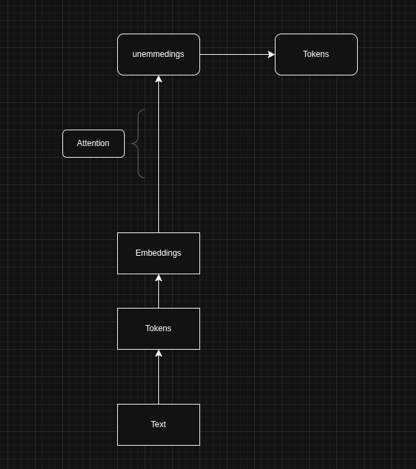

## Understanding LLMs : 101

### What are LLMs ?
LLMs deep learning models which are complex network of mathematical and statistical algorthims.
So basically LLMs  process numbers not text. LLMs needs special representation of text into numbers which we call embeddings.

>LLMs are neural networks that learn statistical patterns in language and generate text by predicting the next token.

#### Text to Numbers
Converting text into numbers involves 2 steps:
1. Tokeniation
2. Embeddings

>Text (into) Tokens (have) Token IDs (into) Embeddings (into) Model (gives out) Output Tokens

**What is a token ?**
A piece of text that can be represented as an integer is a token.
We can produce tokens in different ways from a textual dataset (corpora).
The technique of producing tokens out of textual dataset is called tokenization.

**Character Based tokenization:**
In this technique we tend to consider each character as token and assign them a unique integer value.

Example for "Hello":

| Token | Token ID |
| --- | --- |
| H | 101 |
| e | 102 |
| l | 103 |
| l | 103 |
| o | 104 |

**Sub-Word based tokenization**
In this technique we split a word into parts those part are not necessary to be meaningful or ever could exist idenpendenly. 

Example : Hello

| Token | Token ID |
| --- | --- |
| He | 1544 |
| llo | 18798 |

**Full Word based tokenization**
In this technique we make token by segmenting textual data into full works.

**What are embeddings ?**
Embeddings are dense vector representations of tokens.

>"Hello" into 24567 into [0.12, -0.98, 0.44, ..., 768 dimensions]

Why not use tokens already ?
Token IDs are just integer representation tokens they don't carry semantic relations with other tokens. 

Basically embeddings have advantages over integer repesentation of tokens:
1. More text can be represented using fewer numbers.
2. Semantic relation across tokens can be represented.

---
**What method of tokenization to use ?**
At surface level the character based tokenization seems best. So why not just use character based tokenization ?

Problem 1: According to ASCII, 150K character which increase over time.

- If the token list is updated we need to retain the LLMs over the updated token scheme which is not feasible.

Problem 2: This method of tokenization ignores the statistical regularties in languages.

- every language have its on statistical regularities which can be leveraged based to improve the tokenization algorithms and improve overall LLM responses.

Problem 3: Require a lot of additional memory, which limits the context models.

---
**LLMs work on embeddings:**
Tokens must be modified into embeddings before LLMs process them.
LLMs modifies the embeddings for classification & generation.

#### Challenges of Tokenization

- Fewer tokens improve computational efficiency and reduce memory usage, but excessive compression can harm generalization and representation quality.
- More tokens reduce compression and increase computational cost, but improve flexibility in handling rare and unseen words.
- Token distributions and statistical dependencies vary across languages and domains, making universal tokenization difficult.
- Tokenization is data-dependent; different training dataset produce different vocabularies and segmentation strategies.
- Different tokenization algorithms optimize different objectives such as compression (BPE), likelihood (WordPiece), or probabilistic modeling (Unigram LM).

#### Implications

- Tokenization is a statistical design process requiring multiple decisions (vocabulary size, normalization, segmentation rules), each affecting model performance.
- Embeddings add further complexity, involving representation learning choices and alignment with tokenization.
- Tokenization and embeddings are tightly coupled to training data and model architecture, making them non-transferable across models without retraining.

#### Tokenization & Vocabulary

**Vocabulary**
- Vocabulary = Unique set of tokens in a tokenizer
- Tokens can be:
    - Characters
    - Words
    - Subwords
    - Numbers, code, emojis, etc.

**Encoder & Decoder**
>Encoder → Converts text → integers (tokens → IDs)
>Decoder → Converts integers → text

**Real Tokenization Methods**
Used in LLMs instead of simple splitting:

- BPE (Byte Pair Encoding)
- WordPiece
- SentencePiece

    Why?
    - Handle unknown words
    - Reduce vocabulary size
    - Capture subword patterns

---
*Basically what 'goes in' will 'come out'.*

